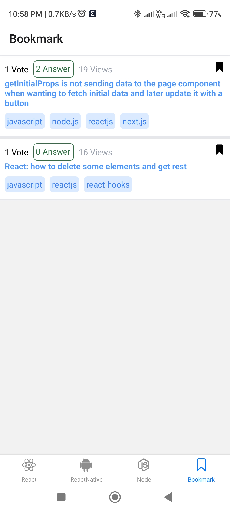

# StackOverflow

## Demo 

Click on following banner

[](https://youtu.be/5FofpcMkck4)

## Technology

- [React Native](https://reactnative.dev/)
- [NativeWind](https://www.nativewind.dev/)
- [React Navigation](https://reactnavigation.org/)
- [Redux Toolkit](https://redux-toolkit.js.org/)

### Prerequisites

* [nodejs](https://nodejs.org/en/download/) for install require package with npm
* [androidStudio](https://developer.android.com/studio) require Android SDK and Virtual Mobile (if required)

```bash
npx create-expo-app AwesomeProject
```

#### How to use

Clone GitHub Project on your PC

```bash
git clone https://github.com/nayanrdeveloper/stackoverlow_task_assignment
```

```bash
npm install
```

```bash
npx expo start
```

### Screenshots

Splash


Question Screen


Question with Bookmark


Message

